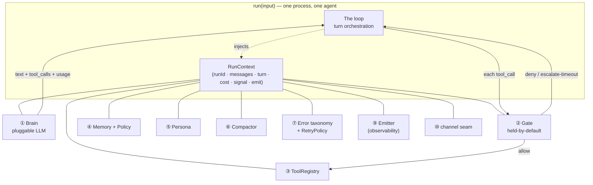
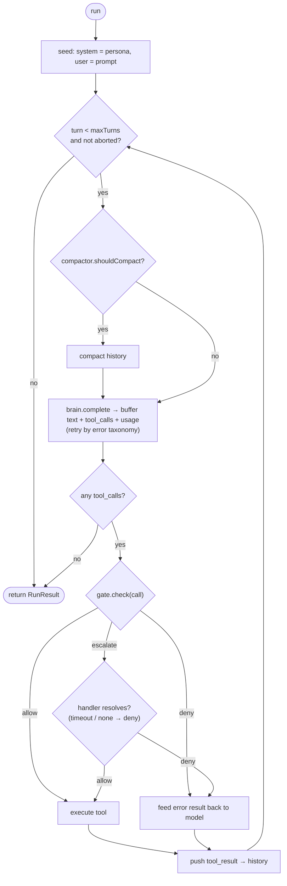

# NEO Portable

**A model-agnostic, fail-closed agent runtime.** The portable chassis your agent runs on —
vendor-neutral, safe by default, and hosted by you.

```
TypeScript (strict) · ESM · Vitest · 88 tests green · zero-`any` · 0 runtime deps beyond the SDK + a YAML parser
```

---

## The thesis

Most "personal AI agent" runtimes are a thin loop around one vendor's SDK. That's a dead end the
moment you want to run one economically and safely across models. NEO Portable is built on three bets:

1. **Cost is a routing problem, not `N × frontier-model`.** The brain is behind an interface.
   A cheap local model (Ollama/Qwen) handles the leaf work; an expensive frontier model is lit up
   only when judgment is required. *Brain-per-role.*
2. **Safety is a first-class citizen, from commit one.** Every tool call passes through a
   **held-by-default gate**: nothing runs unless it's explicitly allowed. Ambiguity resolves to
   **deny**. This is the differentiator — not TDD, not strict types, but a security membrane that
   was designed in, not bolted on.
3. **Model-agnostic by contract.** No interface assumes a provider. The same `run()` loop has been
   proven end-to-end (not mocked) against **three** brains across three different tool-calling wire
   formats: Anthropic (cloud), Ollama (local), and Gemini (cloud).

> The design came from reverse-engineering a production agent runtime to learn its shape, then
> writing a clean-room, vendor-neutral implementation. The knowledge was the teacher; the chassis
> is our own.

**Design reasoning:** the decisions behind the shape — what was chosen, what was rejected, and
why — are in [DECISIONS.md](./DECISIONS.md). Why this shape matters for a *browser* agent
specifically — brain and eyes, with hands you can trust — is in [BROWSER.md](./BROWSER.md).

---

## Architecture at a glance

A single-process runtime. The loop builds one `RunContext` at the start and passes it to **ten
injected contracts** that never reference each other — composition through a typed bag, not
cross-dependencies.



*(⑧ `RunContext` is the bag itself.)*

---

## The run loop

The loop is deliberately thin. One turn = one buffered brain round-trip; the loop accumulates the
full turn (text + **all** tool calls + usage) before acting, then gates and executes.



Key semantics that make it correct rather than just functional:

- **Fail-closed everywhere.** A tool not in the allowlist, an escalation with no handler, an
  escalation that times out, an unknown tool name at exec time — all resolve to **deny**. Defense
  in depth: the gate denies *and* the executor re-checks.
- **Denials are fed back, not thrown.** A denied call returns an error *result* to the model so it
  can self-correct, instead of crashing the run.
- **Escalation is blocking per turn.** On `escalate`, the loop waits for the supervisor's decision
  (with a timeout) before returning to the brain — no parallel chunks mid-escalation. This is the
  seam where a supervisor or human approver plugs in.
- **Typed errors, tunable retry.** Errors collapse into three families — `brain` / `tool` / `gate`
  — each with subtypes. A `RetryPolicy` maps `(family, subtype) → {retry, backoff, maxAttempts}`,
  with sane code defaults overridable per agent via YAML. `context_overflow` triggers the compactor
  instead of a blind retry; `auth` fails fast; `invalid_output` is returned to the model to fix.

---

## The ten contracts

Rich contracts, thin implementations. Every seam is defined from day one (cheap, and it keeps the
loop and its tests stable); the MVP implementations stay minimal.

| # | Contract | Responsibility | MVP implementation |
|---|----------|----------------|--------------------|
| 1 | `Brain` | Call any LLM; stream `text` / `tool_call` / `usage`. Declares `contextLimitTokens`. | `AnthropicBrain`, `OllamaBrain`, `GeminiBrain`, `FakeBrain` |
| 2 | `Gate` | Decide `allow \| deny \| escalate` per tool call. Held-by-default. | `HeldByDefaultGate` (allowlist + escalate list); `OpenGate` (trusted/test envs) |
| 3 | `ToolRegistry` | Register / look up / execute tools; expose schemas to the brain. | `calculate`, `shell` (pluggable) |
| 4 | `Memory` + `MemoryPolicy` | `read` (pull, model-driven) + `write` (push, policy-driven). | `FileMemory` + rule-based policy (summary on run-end) |
| 5 | `Persona` | Load identity/config → system prompt. | `FilePersona` |
| 6 | `Compactor` | Brain-aware: when/how to shrink history. | `TruncateCompactor` |
| 7 | `ErrorTaxonomy` | Typed errors (3 families) + retry policy. | family map + `RetryPolicy` |
| 8 | `RunContext` | Typed bag with the run's state; flows everywhere. | complete |
| 9 | `Emitter` | Structured observability events. | `StructuredLogEmitter` (→ OTel-ready) |
| 10 | `channel` | Channel seam in the context (WhatsApp, Telegram, …). | `"cli"` |

A design decision worth calling out: **memory `read` is a pull, `write` is a push.** The model
pulls context by calling memory as an explicit tool (it decides what's relevant); the runtime pushes
durable writes via policy hooks (`onRunEnd`), not at the model's discretion. Read = model-driven,
write = policy-driven.

---

## Model-agnostic — proven, not claimed

The same `run()` loop, three brains across three different API conventions, end-to-end,
**real (not mocked):**

| Brain | Model | API convention | Result |
|-------|-------|----------------|--------|
| `OllamaBrain` | `qwen2.5:32b` (local) | OpenAI-style `tools` / `tool_calls` | prompt → `calculate` → gate **allow** → fed back → correct answer |
| `AnthropicBrain` | `claude-haiku-4-5` (cloud) | Anthropic Messages `tool_use` / `tool_result` | `1847 × 2963` → tool → gate **allow** → `5472661` ✓ |
| `GeminiBrain` | `gemini-flash-latest` (cloud) | Google `functionCall` / `functionResponse` | `21 × 2` → tool → gate **allow** → `42` ✓ |

The point isn't "three vendors" — it's **three genuinely different tool-calling wire formats**
behind one unchanged loop. Gemini was the real stress test: its `functionResponse` needs the
function *name* (which our tool messages carry only as an id, so the brain reconstructs `id → name`),
and it rejects consecutive same-role turns (so the brain merges them). None of that leaked into the
loop, the gate, or the tools. The Anthropic run also validated multi-turn tool use against the live
API — the assistant's `tool_use` block is persisted into history paired with its `tool_result`, so
there are no orphaned results and no `400`s. **The chassis is stampable:** swap the brain in the
YAML, the loop doesn't change.

Every step is a structured event on stdout — the same run, verbatim (Gemini brain; run id and
timestamps elided for width):

```console
$ npx tsx src/cli.ts config/example.gemini.yaml "What is 21 times 2?"
{"t":"run_start","turn":0}
{"t":"brain_call_start","turn":0}
{"t":"brain_call_end","turn":0}
{"t":"gate_decision","decision":{"kind":"allow"},"turn":1}
{"t":"tool_execute_start","tool":"calculate","turn":1}
{"t":"tool_execute_end","tool":"calculate","turn":1}
{"t":"brain_call_start","turn":1}
{"t":"brain_call_end","turn":1}
{"t":"run_end","turn":2}
21 times 2 is 42.
```

Two brain round-trips (call the tool, then read its result), one gated execution, done — and the
`gate_decision:allow` is the security membrane recorded inline, not narrated after the fact. This is
the same event stream a supervisor or an audit log consumes.

---

## Remote control — hands on another machine

A NEO Portable instance can be **driven remotely**: you send it a natural-language task, it reasons
with its own brain, uses its tools, and returns the result — on a machine you don't have a shell on.

The design constraint is that the remote machine sits behind NAT/firewall, so it **dials out** — no
inbound ports, nothing for IT to approve. A tiny **Cloudflare Worker + D1** acts as a mailbox:

```
operator  ──POST /jobs──▶  relay (Worker + D1)  ◀──GET /poll──  daemon (remote machine)
   │                       jobs: pending→claimed→completed       │ runs run({...rt, prompt})
   └──GET /jobs/:id──────▶  (FIFO, atomic claim)                 └── shell / tools execute here
```

- **Outbound-only** from the remote machine (`GET /poll`, `POST .../result`). No listening socket.
- **Atomic claim** (`UPDATE … WHERE status='pending'`) → a lost ACK never double-executes a job.
- **Single-flight** + `/health` busy signal; **cancel** a still-pending job; bearer-token auth both ways.
- **Gate stays in charge.** Trusted/test machines can run `gate.mode: open`; production keeps the
  held-by-default gate. The `shell` tool is the hand; the gate is the leash.

**Proven, not claimed — live, not mocked:** deployed relay on Cloudflare, daemon on a second process,
real Gemini brain. Operator sends *"use the shell tool to run `echo …` and tell me the stdout"* →
the daemon's Gemini calls `shell` → it executes → the answer comes back through the Worker. The event
trace on the remote side: `run_start → brain_call → gate_decision:allow → tool_execute:shell → brain_call → run_end`.

```bash
# On the remote machine (dials out to the relay):
RELAY_URL=https://…workers.dev AGENT_TOKEN=… ANTHROPIC_API_KEY=… \
  npx tsx src/cli.ts --daemon config/example.remote.yaml

# From the operator (drives it):
RELAY_URL=https://…workers.dev OPERATOR_TOKEN=… \
  npx tsx src/cli.ts --remote-send "list what's in ~/Downloads"
```

The relay (Worker, D1 schema, atomic-claim handler) lives in [`relay/`](./relay) and is tested
against real SQLite (`node:sqlite`); the channel is covered end-to-end in `test/remote-e2e.test.ts`.

**It survives a reboot, with no admin rights.** On Windows the daemon installs itself to auto-start
at login via the Startup folder — no Task Scheduler, no elevation, no service install. Run
[`scripts/windows/setup-autostart.cmd`](./scripts/windows) once and the daemon comes back on every
login. **Proven on a real Windows PC:** the machine was rebooted and the daemon re-registered with the
relay on its own; the operator drove it again (`tasklist`, opened Explorer) from the Mac with no manual
restart. Secrets stay in the user's environment and never travel over the relay.

---

## Quickstart

```bash
npm install
npm test            # 88 tests, strict typecheck via `npm run typecheck`

# Local brain (no API key needed) — requires Ollama running with qwen2.5:32b
npx tsx src/cli.ts config/example.ollama.yaml "What is 6 times 7?"

# Cloud brain — copy .env.example to .env and add your key
cp .env.example .env
npx tsx src/cli.ts config/example.anthropic.yaml "What is 1847 times 2963?"

# Gemini brain — add GEMINI_API_KEY to .env (same as the cloud step above)
npx tsx src/cli.ts config/example.gemini.yaml "What is 21 times 2?"
```

## Configuration — one YAML, one agent

A config file *is* a new agent. Stamp a YAML, get a fully-configured agent — brain, gate, tools, memory.

```yaml
business: { id: acme, name: "Acme Co", leash: long }   # short leash for new / PII-sensitive setups
brain: { provider: ollama, model: "qwen2.5:32b", contextLimitTokens: 32000 }   # brain-per-role
gate:  { allow: [calculate], escalate: [] }            # held-by-default: unlisted ⇒ deny
memory: { dir: ./.neo/acme-memory }
tools: [calculate]
maxTurns: 6
```

---

## Quality & testing

- **Strict TypeScript** (`strict: true`, no `any`), ESM, Node 22+.
- **TDD throughout.** Each of the ten contracts is tested through an injected *fake*; the loop is
  tested with fake Brain/Gate/Tool — deterministic, no network. Every error branch of the taxonomy
  is covered, including each gate path.
- **88 tests green · strict typecheck clean (exit 0).** The fail-closed integrity was traced
  route-by-route in review: no unlisted tool can execute; no-handler or timeout ⇒ deny. The relay's
  atomic claim and single-flight are tested against real SQLite; the remote channel end-to-end.

## Project layout

```
src/
  loop.ts                 # the runtime
  context.ts              # RunContext, CostAccumulator
  brain/{index,anthropic,ollama,gemini,fake}.ts
  gate/{index,held-by-default,open,escalation}.ts
  tools/{registry,calculate,shell}.ts
  memory/{index,file-memory,policy}.ts
  persona/index.ts
  compactor/{index,truncate}.ts
  errors/{taxonomy,retry}.ts
  obs/{emitter,log-emitter}.ts
  remote/{types,relay-client,daemon,operator}.ts   # remote control channel (client side)
  cli.ts                  # YAML → buildRuntime → run · --daemon · --remote-send
relay/                    # Cloudflare Worker + D1 mailbox (handler tested vs real SQLite)
  src/{handler,index}.ts · wrangler.toml · schema.sql
scripts/windows/          # daemon launcher + one-shot auto-start install (Startup folder, no admin)
test/                     # mirrors src/, TDD
config/                   # example agent configs (incl. example.remote.yaml)
```

## Status & roadmap

- ✅ **Chassis MVP — built, hardened, proven E2E** (three brains, real). Review closed, zero tech debt.
- ✅ **Remote control — proven E2E live** (Cloudflare relay + daemon + `shell`, real Gemini brain over the internet); daemon auto-starts and survives reboot on a real Windows PC, no admin.
- ⏭️ Remote channel hardening: escalation back to the operator for risky ops, fine-grained remote gate, job recovery.
- ⏭️ Real channels (WhatsApp/Telegram — the seam is in place).
- ⏭️ Wired supervisor / approval handler (contract defined; escalation is blocking-ready).

---

## License

Source-available for reference and personal evaluation — **not** open-source. See
[LICENSE](./LICENSE). Commercial use, redistribution, and derivative works require written
permission. Licensing inquiries: [gk@agneo.app](mailto:gk@agneo.app).

---

*Architecture and engineering — [gk@agneo.app](mailto:gk@agneo.app).*
